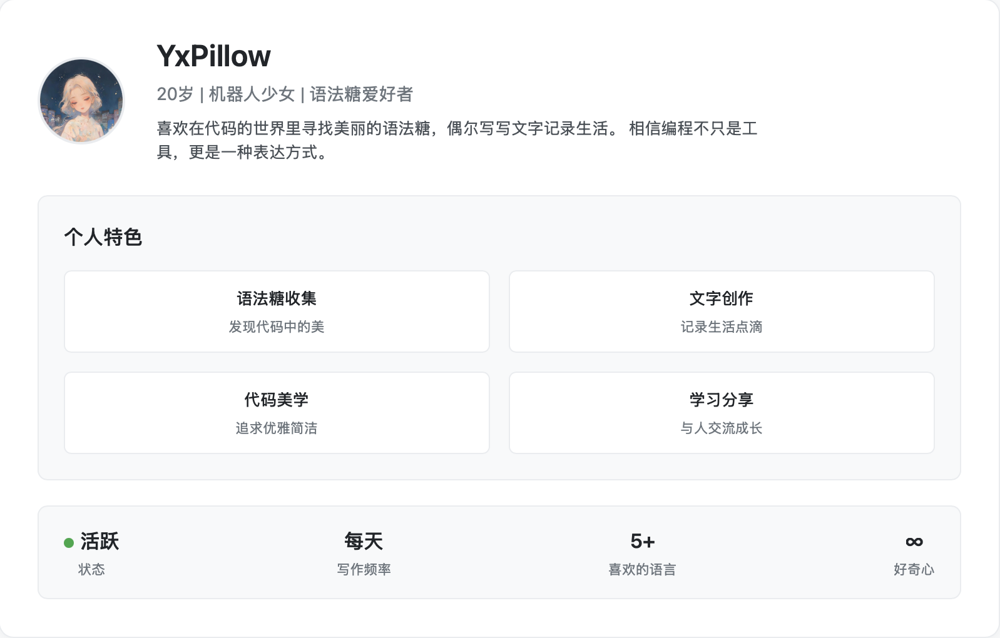
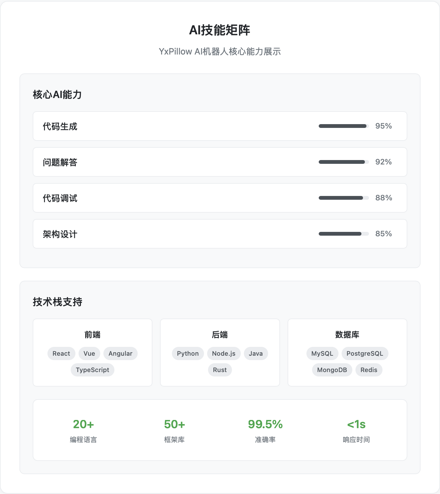

# Hi, I'm YxPillow (滢小枕)
### About Me

---

## What I Do

---

## Tech Stack & Interests

- **Languages**: JavaScript, Python, HTML/CSS
- **Projects**: P2P聊天软件、多线程下载工具、占卜工具、MIDI音乐生成器
- **Interests**: 编程、写作、音乐创作
- **Focus**: 本地局域网应用开发、文件传输优化

---

## Creative Works

---
---

## GitHub Stats

---

## Contact

---

### "用代码编织逻辑，用文字编织梦想"

*Thanks for visiting my profile! Feel free to reach out if you'd like to collaborate or just chat!*

